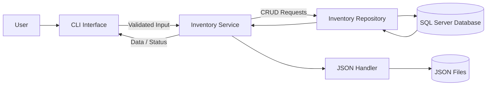
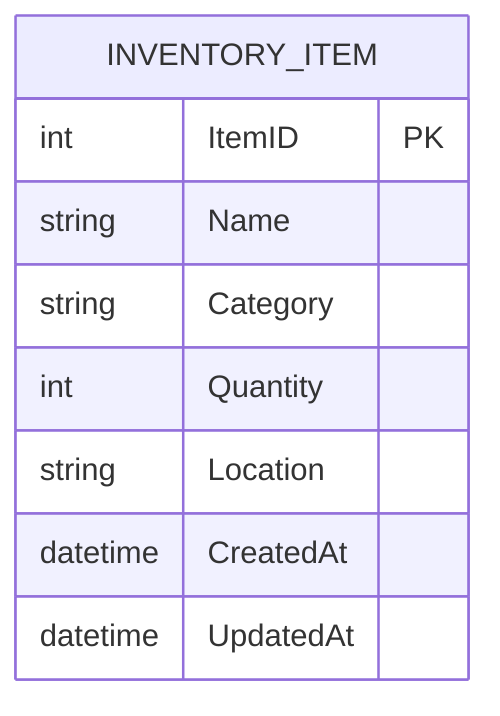
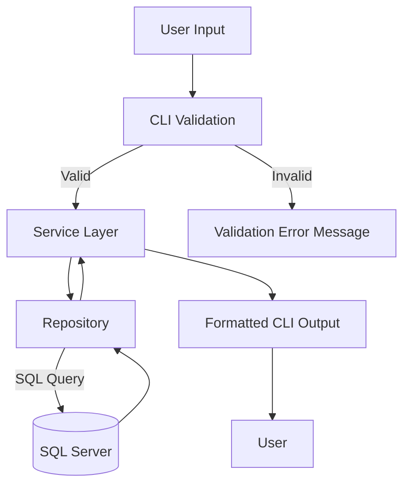
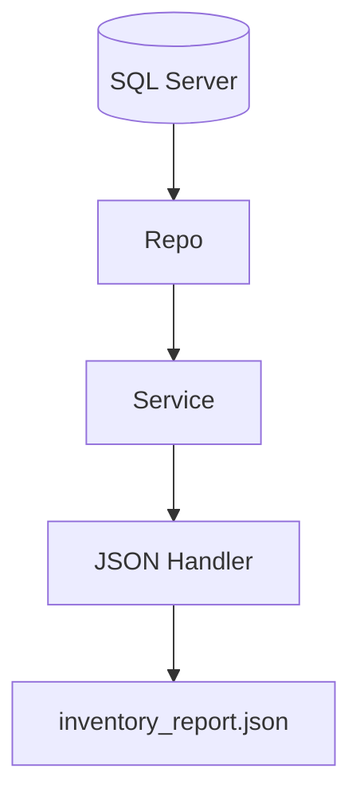
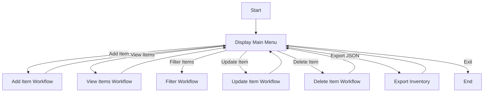
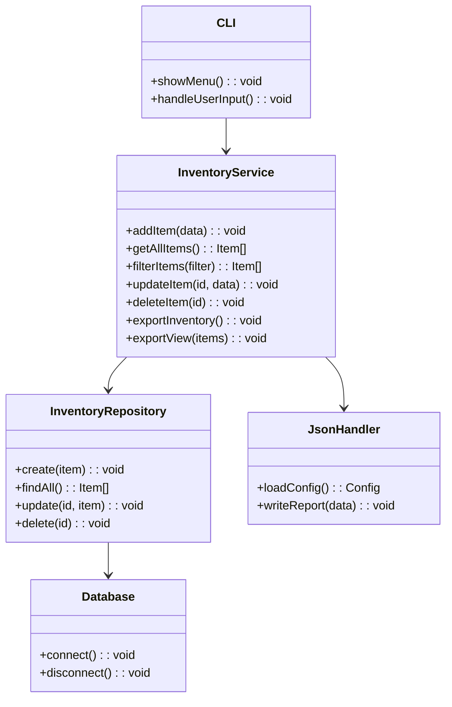

# System Design Documentation

## 1. Application Architecture

### 1.1 Architectural Overview

The Inventory Management Console Application is designed using a **layered architecture** pattern. This approach enforces separation of concerns, improves maintainability, and allows individual components to be tested and extended independently.

The system is composed of five main layers:

1. **Presentation Layer (CLI)** – Handles all user interactions via the command line.
2. **Application / Service Layer** – Contains business rules, validation logic, and workflow coordination.
3. **Data Access Layer (Repository)** – Abstracts database operations and shields the rest of the system from SQL-specific logic.
4. **Database Layer (SQL Server)** – Provides persistent storage for inventory data.
5. **File System Layer (JSON Handling)** – Manages configuration loading and JSON-based reporting/export features.

This architecture ensures that:

- User input is validated before reaching the database
- Business rules are centralized and consistently enforced
- Database logic is isolated and replaceable
- JSON file handling is decoupled from core business logic

### 1.2 Application Architecture Diagram



This diagram illustrates how user commands flow through the system layers and how persistent and file-based storage are accessed.

---

## 2. Database Schema Design

### 2.1 Entity Overview

The system uses a single core entity, **InventoryItem**, to keep the design beginner-friendly while still demonstrating real-world relational database practices and constraints.

### 2.2 Table Definition: InventoryItem

| Field Name | Data Type     | Constraints & Rules                    |
| ---------- | ------------- | -------------------------------------- |
| ItemID     | INT           | Primary Key, Identity (Auto Increment) |
| Name       | NVARCHAR(100) | NOT NULL                               |
| Category   | NVARCHAR(50)  | NOT NULL                               |
| Quantity   | INT           | NOT NULL, CHECK (Quantity >= 0)        |
| Location   | NVARCHAR(50)  | NULL                                   |
| CreatedAt  | DATETIME      | NOT NULL, DEFAULT GETDATE()            |
| UpdatedAt  | DATETIME      | NULL (Updated on record modification)  |

### 2.3 Design Considerations

- **Quantity constraint** ensures stock values cannot be negative
- **CreatedAt / UpdatedAt** provide basic auditing and traceability
- Indexes may be added on `Name` and `Category` to improve search performance

### 2.4 Entity-Relationship Diagram (ERD)



Since the application uses a single table, there are no foreign key relationships; however, the design allows future extension (e.g., Categories table).

---

## 3. Data Flow Diagrams

### 3.1 Core CRUD Data Flow

This diagram shows the complete data path from user input to database persistence and back to user output, including validation and error handling.



### 3.2 JSON Export Data Flow

This diagram illustrates how inventory data is exported from the database into a JSON report file.



---

## 4. JSON File Structure

### 4.1 JSON Files Used

| File Name             | Purpose                                  |
| --------------------- | ---------------------------------------- |
| config.json           | Stores database and application settings |
| inventory_report.json | Inventory export and backup report       |

### 4.2 config.json

**Purpose:** Centralized configuration management to avoid hardcoding sensitive or environment-specific values.

```json
{
  "database": {
    "server": "localhost",
    "database": "InventoryDB",
    "user": "sa",
    "password": "your_password",
    "options": {
      "encrypt": false
    }
  }
}
```

### 4.3 inventory_report.json

**Purpose:** Used for inventory backup, reporting, and potential data migration.

```json
{
  "generatedAt": "2026-01-08T10:00:00",
  "totalItems": 3,
  "items": [
    {
      "itemId": 1,
      "name": "Keyboard",
      "category": "Electronics",
      "quantity": 10,
      "location": "Warehouse A"
    }
  ]
}
```

**Filtered / View JSON:** When users filter or view subsets of inventory, exported JSON for those views will include only the curated fields used for reporting: `itemId`, `name`, `category`, `quantity`, and `location` (if present). Example filtered view output:

```json
{
  "generatedAt": "2026-01-08T10:30:00",
  "totalItems": 1,
  "items": [
    {
      "itemId": 1,
      "name": "Keyboard",
      "category": "Electronics",
      "quantity": 10,
      "location": "Warehouse A"
    }
  ]
}
```

---

## 5. Application Flow Diagram



This flow demonstrates the full lifecycle of a user session within the application.

---

## 6. Class / Module Structure

### 6.1 Module Responsibilities

- **CLI**: Displays menus, collects user input, performs basic validation
- **InventoryService**: Enforces business rules and coordinates workflows
- **InventoryRepository**: Executes SQL operations against the database
- **Database**: Manages SQL Server connections
- **JsonHandler**: Reads configuration and writes JSON reports

### 6.2 Class Diagram



---
